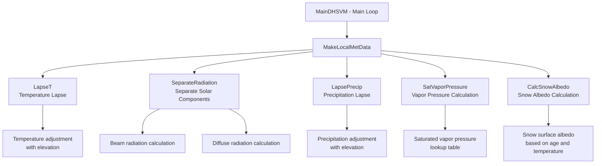
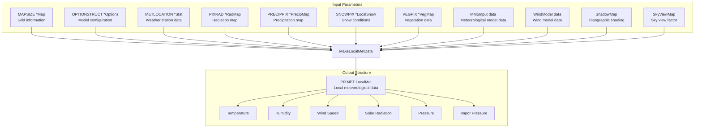
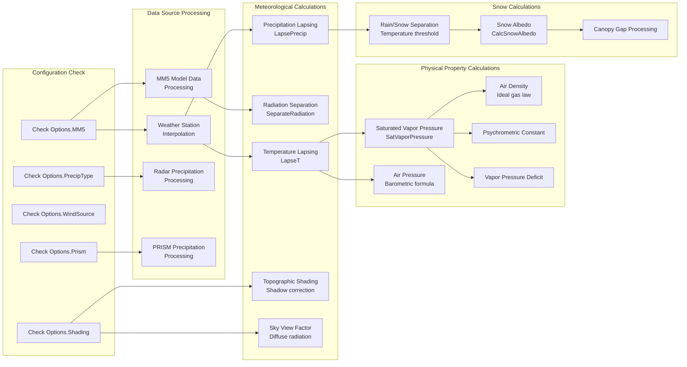
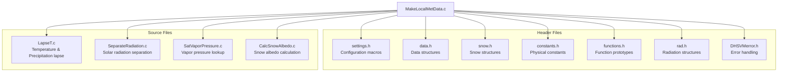

# DHSVM MakeLocalMetData Function Dependencies

Comprehensive dependency diagram for the `MakeLocalMetData` function in the DHSVM model.

## Key Findings:

1. **Function Call Hierarchy**: `MakeLocalMetData` is called from the main simulation loop in `MainDHSVM.c` for each grid cell and calls several utility functions for meteorological calculations.

2. **Main Function Dependencies**:
  - `LapseT()` - Temperature adjustment with elevation
  - `SeparateRadiation()` - Separates solar radiation into beam and diffuse components
  - `LapsePrecip()` - Precipitation adjustment with elevation
  - `SatVaporPressure()` - Calculates saturated vapor pressure using lookup table
  - `CalcSnowAlbedo()` - Calculates snow surface albedo

3. **Data Structure Dependencies**: The function takes 18+ input parameters including maps, weather station data, model configuration options, and various meteorological grids.

4. **Processing Flow**: The function follows a complex decision tree based on configuration options (MM5 vs station data, shading options, precipitation sources) and performs extensive meteorological calculations.

5. **File Dependencies**: Includes 7 header files and depends on 4 separate source files for the utility functions.

The function is central to DHSVM's meteorological processing, generating local meteorological conditions for each grid cell by interpolating or processing various data sources (weather stations, MM5 model output, radar precipitation) and applying topographic corrections, lapse rates, and physical property calculations.

This diagram should help you understand how `MakeLocalMetData` fits into the overall DHSVM architecture and its various dependencies for generating spatially distributed meteorological forcing data

## Function Call Hierarchy

## Data Structure Dependencies

## Processing Flow Dependencies

## File Dependencies

## Key Constants Used

- **CP**: Specific heat of moist air (1013.0 J/(kg*C))
- **EPS**: Ratio of molecular weights (0.622)
- **SOLARCON**: Solar constant
- **CELL_PARTITION**: Number of vegetation types per cell (2)

## Major Decision Points

1. **MM5 vs Station Data**: Determines data source for meteorological variables
2. **Shading Options**: Controls topographic and canopy shading calculations
3. **Wind Source**: MODEL vs STATION for wind data
4. **Precipitation Type**: STATION vs RADAR for precipitation data
5. **PRISM**: Special precipitation interpolation method
6. **Precipitation Separation**: Combined vs separate rain/snow input

## Output Variables Computed

- Air temperature (°C)
- Relative humidity (%)
- Wind speed (m/s)
- Incoming solar radiation (W/m²)
  - Total, beam, and diffuse components
- Incoming longwave radiation (W/m²)
- Air pressure (Pa)
- Saturated vapor pressure (Pa)
- Actual vapor pressure (Pa)
- Vapor pressure deficit (Pa)
- Air density (kg/m³)
- Psychrometric constant
- Snow albedo
- Precipitation components (rain/snow)
